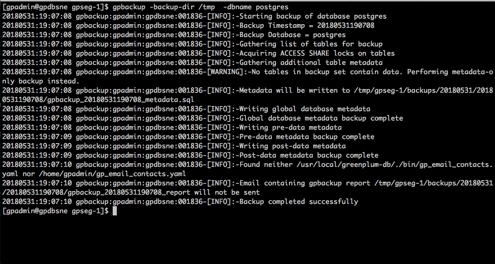
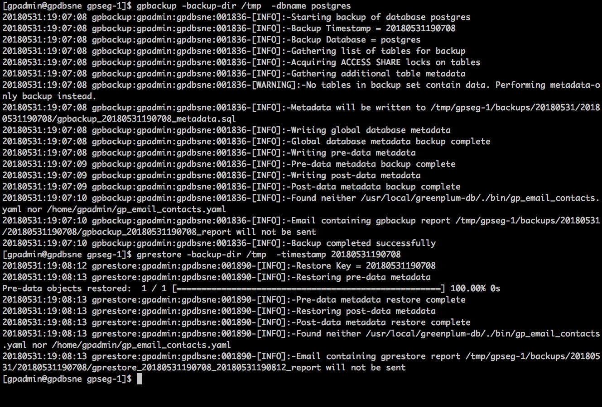

# Readme
This repository provides examples on how to use backup/restore tool for
Greenplum.

# Use Case
1. [Learn how to use gpbackup and gprestore](#usecase1/README.MD)

## Use gpbackup and gprestore
Now, you can run parallel backup solution for Greenplum. gpbackup and gprestore are designed to improve the performance, functionality, and reliability of backups as compared to gpcrondump and gpdbrestore.

### gpbackup
gpbackup utilizes ACCESS SHARE locks at the individual table level, instead of EXCLUSIVE locks on the pg_class catalog table.

 This enables you to execute DML statements during the backup, such as CREATE, ALTER, DROP, and TRUNCATE operations, as long as those operations do not target the current backup set.

 Therefore, you can quickly run parallel backup to ensure your data is safely protected.

For more details,[see this readme](#usecase1/README.MD)

** GPBackup **

** GPbackup and GPrestore **

# Reference:
## Greenplum
The Greenplum Database (GPDB) is an advanced, fully featured, open source data warehouse. It provides powerful and rapid analytics on petabyte scale data volumes. Uniquely geared toward big data analytics, Greenplum Database is powered by the world’s most advanced cost-based query optimizer delivering high analytical query performance on large data volumes.
[Greenplum](https://greenplum.org)
[Pivotal Greenplum](https://pivotal.io/pivotal-greenplum)
